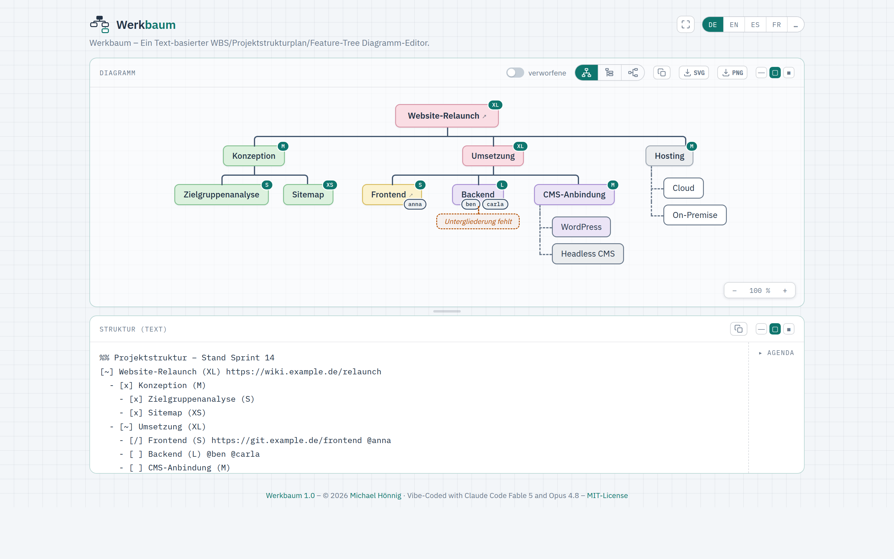

<p>
  
</p>

# Werkbaum

[English](README.md) · **Deutsch**

**▶ Live ausprobieren: <https://werkbaum.javagil.de>** (stabil) · <https://mhoennig.github.io/werkbaum/> (jeweils neuester Build 🚧)

Eine textuelle, Markdown-artige Notation für Projektstrukturpläne
(Work Breakdown Structure) mit Und/Oder-Zerlegung — und ein Live-Editor,
der sie als Diagramm rendert.

```
[~] Werkbaum (XL) https://wiki.example.de/relaunch
  - [~] Dokumentenspeicher
    | [x] Textdatei mit Copy+Paste im Frontend (S)
        - [x] Parser
        - [x] Texteingabefeld im Frontend
    | [ ] Backend
  - [~] Darstellung/Rendern (XL)
    - [/] H (S) @anna
    - [ ] CMS-Anbindung (M)
      | [ ] WordPress
      | [?] Headless CMS
```

`-` = Pflicht-Teilpaket (all of, im Diagramm nebeneinander) ·
`|` = Alternative (any of, untereinander) · `[…]` = Status ·
`(M)` = T-Shirt-Aufwand · `@name` = Zuständigkeit · `%%` = Kommentar.

## Nutzung



Den [gehosteten Editor](https://werkbaum.javagil.de) öffnen — links
Text bearbeiten, rechts entsteht das Diagramm live. Toggles: transponierte
(schmale) Darstellung, verworfene Elemente einblenden.

### Lokal ausführen

Die Editor-Quelle liegt jetzt als ES-Module unter `frontend/src/`, gebündelt mit
[Vite](https://vitejs.dev/) (siehe `docs/DECISIONS.md` D19). Da Browser
ES-Modul-Importe über `file://` blocken, funktioniert das direkte Öffnen von
`frontend/index.html` nicht mehr — stattdessen:

```bash
cd frontend
npm install          # einmalig
npm run dev          # Dev-Server unter http://localhost:8137
npm test             # Vitest-Unit-Tests
npm run build        # -> frontend/dist/index.html (eine self-contained Datei)
```

Die gebaute `dist/index.html` inlint JS, CSS und Favicon — **diese** Datei öffnet
also standalone per `file://` und ist zugleich das, was deployt wird.

### Build-Hinweis & eigene Produktions-Installation

Nicht-produktive Builds tragen hinter dem Titel einen kleinen Hinweis (Symbol +
Tooltip), damit klar ist, dass es **nicht** die stabile Instanz ist:

- **Dev-Server** (`npm run dev`) → 🔧 „Vorschau – lokaler Entwicklungsstand"
- **Default-Build** (`npm run build`, u. a. der GitHub-Pages-Deploy) → 🚧
  „Aktueller Entwicklungsstand (latest build) – kann noch Fehler enthalten"

Für die **eigene produktive Installation** wird der Hinweis abgeschaltet:

```bash
cd frontend
npm ci                # oder: npm install
npm run build:prod    # -> frontend/dist/index.html OHNE Hinweis
```

`build:prod` läuft im Vite-Modus `prod`; `frontend/.env.prod` setzt dabei
`VITE_BUILD_BADGE=none`, wodurch der Badge-Code komplett wegoptimiert wird (er
steht dann nicht einmal mehr im Quelltext der Ausgabe). Die entstandene
`dist/index.html` legst du standalone auf deinen Webspace/Server (`file://`-
tauglich). Steuerung im Detail: `app.js` (`mountBuildBadge`), `docs/DECISIONS.md`
D16.

Zwei Dinge, die sonst nur der Pages-Workflow erledigt und die du im Eigenbetrieb
selbst geradeziehst: der Footer-Link **MIT-License** zeigt relativ auf
`../LICENSE` (lege die Datei eine Ebene über `index.html` ab oder passe den Link
an), und die **Versionsnummer** bleibt der Quelltext-Platzhalter `1.0` (der
Workflow ersetzt ihn sonst aus `VERSION` + Commit-Zahl).

**Bequemer: `scripts/deploy-prod.sh`.** Das Skript macht genau den obigen
Prod-Build **und** die beiden Nacharbeiten (LICENSE danebenlegen + Link
geradeziehen, Footer-Version + Commit-Link wie beim Pages-Workflow) und spiegelt
das Ergebnis per rsync/SSH auf einen Server:

```bash
scripts/deploy-prod.sh mih00@mih00.hostsharing.net:~/doms/werkbaum.javagil.de/htdocs-ssl
```

Das Ziel ist entweder dieses Argument oder — ohne Argument — die Variable
`DEPLOY_TARGET` aus der **git-ignorierten** Datei `.env` (Vorlage:
`.env.example`, einmal kopieren und den Pfad eintragen). Ein
Argument hat Vorrang.

Ohne `-y` zeigt es zuerst eine `--dry-run`-Vorschau und fragt nach. `rsync
--delete` sorgt dafür, dass am Ziel **nichts Altes** stehen bleibt — das
Zielverzeichnis gilt also als exklusiv für Werkbaum (eine laufende Let's-Encrypt-
Challenge unter `.well-known/` wird per `--filter=protect` ausgenommen, web-
taugliche Rechte 755/644 werden erzwungen). (Hostsharing: eine **direkt
aufgeschaltete** Domain liefert aus `…/htdocs-ssl/`; als **Subdomain** unter einer
anderen Domain läge das Web-Verzeichnis in `…/subs-ssl/<name>/`.)

## Projektdokumente

- `frontend/` — Editor · `backend/` — Kotlin/Spring (Gerüst folgt, siehe backend/README.md)
- `docs/SPEC.md` — verbindliche Sprachdefinition
- `docs/DECISIONS.md` — Design-Entscheidungen mit Begründung
- `docs/ROADMAP.md` — Mermaid-Plugin, Taiga-Integration, Tenzu
- `docs/TASKS.md` — offene Aufgaben (Checkboxen)
- `docs/brand/BRAND.md` — Logo, Wortbild, Anwendungsregeln
- `docs/design/` — Design-Herleitung der Marke
- `CLAUDE.md` — Projektkontext für Claude Code

## Deployment

Der Editor wird per GitHub Actions als statische Seite auf **GitHub Pages**
veröffentlicht (Workflow: `.github/workflows/pages.yml`). Ausgelöst bei jedem
Push auf `main` sowie manuell (`workflow_dispatch`).

Der Workflow richtet Node ein, führt `npm ci`, `npm test` (Vitest) und
`npm run build` (Vite) aus und veröffentlicht die gebündelte
`frontend/dist/index.html` als `index.html` an der Wurzel-URL, dazu `LICENSE`
für den MIT-Link im Footer. Das Favicon ist im Build bereits inline, es muss also
nichts weiter kopiert werden; nur der Laufzeit-Link `../LICENSE` wird auf der
Kopie geradegezogen. Ein fehlschlagender Test blockiert das Deployment.
`backend/` und die übrigen `docs/` werden nicht veröffentlicht.

Beim Zusammenstellen setzt der Workflow zudem die Versionsnummer im Footer:
**Major.Minor** stammt aus der Datei `VERSION` (per bewusstem „Bump-Commit"
gepflegt), die **Micro-Stelle** aus der Zahl der Commits seit diesem letzten
Bump — sie steigt also mit jedem Commit und beginnt nach einem Bump wieder bei
`0` (`Werkbaum 1.0.0`, `1.0.1`, … dann `VERSION` auf `1.1` bumpen → `1.1.0`). Es
wird nichts ins Repo zurückgeschrieben. Im Footer verlinkt der Name **Werkbaum**
die Repo-Startseite, die **Versionsnummer** genau den zugehörigen Commit
(`…/commit/<sha>`). Lokal geöffnet zeigt der Editor den Platzhalter aus dem
Quelltext (`Werkbaum 1.0`).

**Einmalige Einrichtung:** In den Repo-Settings unter **Pages** als **Source**
„GitHub Actions" wählen. Das Repo muss dafür **öffentlich** sein (GitHub Pages
via Actions ist für private Repos nur mit kostenpflichtigem Plan verfügbar).

## Lizenz

MIT — siehe [LICENSE](LICENSE). © 2026 Michael Hönnig.
