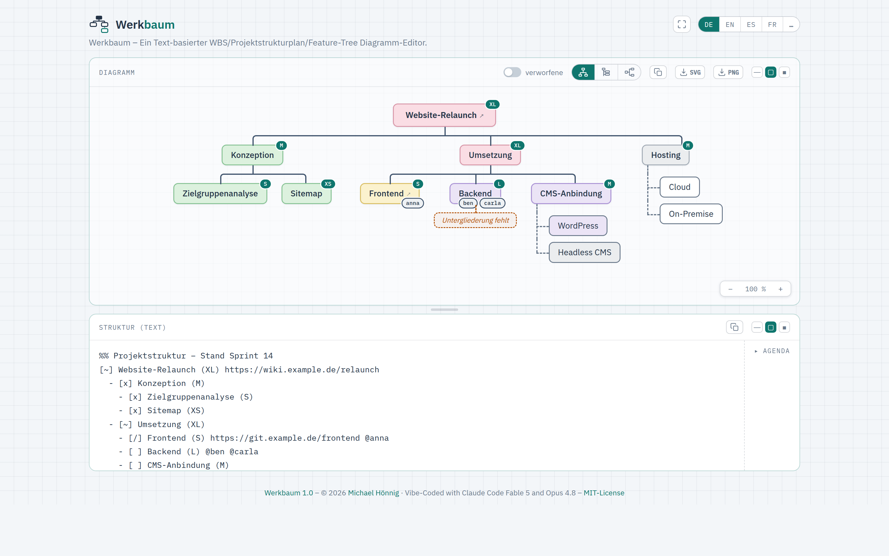

<p>
  
</p>

# Werkbaum

**English** · [Deutsch](README.de.md)

**▶ Try it live: <https://werkbaum.javagil.de>** (stable) · <https://mhoennig.github.io/werkbaum/> (latest build 🚧)

A textual, Markdown-like notation for work breakdown structures with
and/or decomposition — plus a live editor that renders it as a diagram.

```
[~] Werkbaum (XL) https://wiki.example.de/relaunch
  - [~] Document store
    | [x] Text file with copy+paste in the frontend (S)
        - [x] Parser
        - [x] Text input field in the frontend
    | [ ] Backend
  - [~] Display/rendering (XL)
    - [/] H (S) @anna
    - [ ] CMS integration (M)
      | [ ] WordPress
      | [?] Headless CMS
```

`-` = mandatory sub-package (all of, side by side in the diagram) ·
`|` = alternative (any of, stacked) · `[…]` = status ·
`(M)` = T-shirt effort · `@name` = responsibility · `%%` = comment.

## Usage



Open the [hosted editor](https://werkbaum.javagil.de) — edit text on
the left, the diagram is built live on the right. Toggles: transposed (narrow)
layout, show discarded elements.

### Jumping between diagram and text

Diagram and editor are linked in both directions:

- **Alt+click a node** (keyboard: **Alt+Enter**, touch: **long press**) selects
  its line in the text editor — collapsed editor panel opens first.
- **Moving the cursor in the text** highlights the matching node in the diagram.

A plain click keeps its old meaning: a node carrying a URL still opens it.

### Loading a diagram from a URL

The editor can pull its notation text from an external text file via the
`sourceUrl` query parameter — handy for sharing a plan or keeping the source in
Git or a wiki:

```
https://werkbaum.javagil.de/?sourceUrl=https://git.javagil.de/mi/werkbaum/raw/branch/main/docs/examples/example-plan-0.werkbaum
```

Ready-made examples in [`docs/examples/`](docs/examples/) — **open them one
after another**, each becomes its own document, so afterwards you can switch
between all of them in the editor title bar:

| Example | Shows |
|---|---|
| **▶ [0 · Online shop relaunch](https://werkbaum.javagil.de/?sourceUrl=https://git.javagil.de/mi/werkbaum/raw/branch/main/docs/examples/example-plan-0.werkbaum)** | a software project with all eight states |
| **▶ [1 · New kitchen](https://werkbaum.javagil.de/?sourceUrl=https://git.javagil.de/mi/werkbaum/raw/branch/main/docs/examples/example-plan-1.werkbaum)** | a non-software plan, lots of alternatives — good for the cheapest-path toggle |
| **▶ [2 · Community conference](https://werkbaum.javagil.de/?sourceUrl=https://git.javagil.de/mi/werkbaum/raw/branch/main/docs/examples/example-plan-2.werkbaum)** | a wide plan with many people; compare horizontal vs. compact |
| **▶ [3 · Three workstreams](https://werkbaum.javagil.de/?sourceUrl=https://git.javagil.de/mi/werkbaum/raw/branch/main/docs/examples/example-plan-3.werkbaum)** | several roots = several trees side by side |
| **▶ [Werkbaum itself](https://werkbaum.javagil.de/?sourceUrl=https://git.javagil.de/mi/werkbaum/raw/branch/main/docs/examples/werkbaum.werkbaum)** | what exists today and where it could go |

The loaded text becomes its own document whose **name is the URL**, so your own
documents stay untouched; the same link updates that one document instead of
piling up copies. The URL is the source of truth — it is re-fetched on every
load, so local edits to it do not survive a reload.

Notation files use the extension **`.werkbaum`** (UTF-8; see `docs/SPEC.md` §12
and D24) — a convention, not a contract: `sourceUrl` reads any text file over
http(s) regardless of extension or content type.

**Caveat — CORS:** the browser only fetches a foreign host if it sends
`Access-Control-Allow-Origin`. `raw.githubusercontent.com`, GitLab raw links and
`git.javagil.de` do (D96); an arbitrary web server often does not. If loading
fails the previous content stays and a warning explains why. Only `http`/`https`
are allowed.

### Working on one plan together (`?live=`)

If the plan lives on a Werkbaum backend, everyone edits it **in the editor
itself** and sees the others' changes without reloading:

```
https://werkbaum.javagil.de/?live=https://werkbaum.javagil.de/api/v1/documents/<uuid>
```

To create such a document, press the **Share** button in the text editor's
title bar: it uploads the active plan, switches to it, and puts the link in the
address bar and on your clipboard. Share that link — the address is the
invitation, and knowing it is what grants access.

The text area stays **writable**. After 0.6 s of quiet the editor sends the
change as a line diff; an open request holds the other direction ready and plays
foreign changes in. **The caret travels with them** — if someone inserts lines
above you, it stays where it was in the text.

The document's **title** is its name (everyone sees the same one), the full
address sits in the tooltip.

**The address bar follows the document you are on.** Switch to a local plan and
`?live=` goes away; switch to another server document and its address takes its
place — so a reload brings back what you were looking at. Picking a server
document from the menu also puts you back into the shared session.

When two changes really overlap — the same lines — a bar at the top asks whose
version should win: *take theirs* or *keep mine*. Everything else the server
merges without asking. Nothing is lost either way: the discarded state stays in
the earlier states, and every version is in the server's history.

**A shared pointer:** write `!!!` on a line and that node is highlighted and
scrolled into view — for **everyone** looking at the document, which is
something a cursor cannot do. Recognised only as a standalone token, so
`Careful!!!` stays an ordinary label. It stays in the text until someone
deletes it.

**A git history for a shared plan:** `tools/pull-doc <document-url> <file>`
fetches the document (a `?live=` link works too) and writes it to the file;
with `--git-commit` it also commits it into the file's git worktree — date,
title and version in the message, and no commit when nothing changed. Run it
from cron and the plan archives itself; `--open` opens the file in IntelliJ
IDEA afterwards. See `docs/DECISIONS.md` D88.

Setting up the backend: see [backend/README.md](backend/README.md) and
`docs/DECISIONS.md` D76.

> Werkbaum used to borrow an **Etherpad** for this (`?etherpad=`). That is
> removed — the backend does the same job better and in the editor itself. An
> old `?etherpad=` link now shows a note pointing here rather than silently
> doing nothing; see `docs/DECISIONS.md` D78.

### Where the code lives

The repository is at **<https://git.javagil.de/mi/werkbaum>** (Gitea) — that is
`origin`, and that is where branches belong:

```bash
git clone mih09-git@git.javagil.de:mi/werkbaum.git      # or https://git.javagil.de/mi/werkbaum.git
```

**GitHub stays a clone.** `main` is mirrored there by hand
(`scripts/push-github.sh`), because the GitHub Pages instance hangs off it — the
🚧 *latest build* linked at the top. The example links above used to be a second
reason and are not any more: `git.javagil.de` now serves raw files with an
`Access-Control-Allow-Origin` header, so they point at Gitea
(`docs/DECISIONS.md` D96, revising D95).

### Running it locally

The editor source now lives as ES modules under `frontend/src/`, bundled by
[Vite](https://vitejs.dev/) (see `docs/DECISIONS.md` D19). Because browsers block
ES-module imports over `file://`, opening `frontend/index.html` directly no
longer works — use one of:

```bash
cd frontend
npm install          # once
npm run dev          # dev server at http://localhost:8137
npm test             # Vitest unit tests
npm run build        # -> frontend/dist/index.html (single self-contained file)
```

The built `dist/index.html` inlines all JS, CSS and the favicon, so **that** file
does open standalone via `file://` and is what gets deployed.

### Build hint & your own production install

Non-production builds carry a small hint next to the title (symbol + tooltip) so
it's clear this is **not** the stable instance:

- **Dev server** (`npm run dev`) → 🔧 "Preview – local development build"
- **Default build** (`npm run build`, incl. the GitHub Pages deploy) → 🚧
  "Latest build – may still be buggy"

For **your own production install** the hint is switched off:

```bash
cd frontend
npm ci                # or: npm install
npm run build:prod    # -> frontend/dist/index.html WITHOUT the hint
```

`build:prod` runs Vite in mode `prod`; `frontend/.env.prod` sets
`VITE_BUILD_BADGE=none`, so the badge code is tree-shaken away entirely (it isn't
even present in the output source). Drop the resulting `dist/index.html` onto your
web space/server (standalone, `file://`-capable). Details: `app.js`
(`mountBuildBadge`), `docs/DECISIONS.md` D16.

Two things otherwise handled only by the Pages workflow, to fix up yourself when
self-hosting: the footer **MIT-License** link is relative to `../LICENSE` (place
that file one level above `index.html`, or adjust the link), and the **version
number** stays the source placeholder `1.0` (the workflow otherwise replaces it
from `VERSION` + commit count).

**Easier: `scripts/deploy-prod.sh`.** The script runs exactly that prod build
**and** both fix-ups (drop `LICENSE` alongside + straighten the link, footer
version + commit link just like the Pages workflow) and mirrors the result to a
server via rsync/SSH:

```bash
scripts/deploy-prod.sh mih00@mih00.hostsharing.net:~/doms/werkbaum.javagil.de/htdocs-ssl
```

The target is either this argument or — with no argument — the `DEPLOY_TARGET`
variable from the **git-ignored** file `.env` (template:
`.env.example`, copy it once and fill in the path). An argument
takes precedence.

Without `-y` it first shows a `--dry-run` preview and asks for confirmation.
`rsync --delete` ensures **nothing old** is left at the target — so the target
directory is treated as exclusive to Werkbaum (an in-flight Let's Encrypt
challenge under `.well-known/` is spared via `--filter=protect`, and web-friendly
755/644 permissions are enforced). (Hostsharing: a **directly-served** domain is
served from `…/htdocs-ssl/`; as a **subdomain** under another domain the web
directory would be `…/subs-ssl/<name>/`.)

## Project documents

- `frontend/` — editor · `backend/` — Kotlin/Spring (scaffold to follow, see backend/README.md)
- `docs/SPEC.md` — normative language definition
- `docs/DECISIONS.md` — design decisions with rationale
- `docs/ROADMAP.md` — Mermaid plugin, Taiga integration, Tenzu
- `docs/TASKS.md` — open tasks (checkboxes)
- `docs/rfc/` — proposals that span several parts of the repo, weighed before they are built (001: an MCP server for AI agents; 002: the installed app and a browser tab side by side)
- `docs/brand/BRAND.md` — logo, wordmark, usage rules
- `docs/design/` — design derivation of the brand
- `CLAUDE.md` — project context for Claude Code

> **Note:** The detailed project documentation under `docs/` is maintained in
> German, the project's source language (see `CLAUDE.md`). This README is
> available in [English](README.md) and [German](README.de.md).

## Deployment

The editor is published as a static page on **GitHub Pages** via GitHub
Actions (workflow: `.github/workflows/pages.yml`). Triggered on every push to
`main` **of the clone** — that is, after `scripts/push-github.sh` has mirrored it
(D95) — and manually (`workflow_dispatch`).

The workflow sets up Node, runs `npm ci`, `npm test` (Vitest) and `npm run build`
(Vite), then publishes the bundled `frontend/dist/index.html` as `index.html` at
the root URL, plus `LICENSE` for the MIT link in the footer. The favicon is
already inlined into the build, so nothing else needs copying; only the runtime
`../LICENSE` link is straightened on the copy. A failing test blocks the deploy.
`backend/` and the remaining `docs/` are not published.

While assembling the site, the workflow also stamps the version into the footer:
**major.minor** comes from the `VERSION` file (bumped by an explicit "bump
commit"), and the **micro** part is the number of commits since that last bump —
so it grows with every commit and resets to `0` right after a bump
(`Werkbaum 1.0.0`, `1.0.1`, … then bump `VERSION` to `1.1` → `1.1.0`). Nothing is
written back to the repo. In the footer the name **Werkbaum** links to the
repository on Gitea, while the **version number** links to that exact commit
there (`…/commit/<sha>`) — the clone carries the same SHAs. Opened locally, the editor shows the source placeholder
(`Werkbaum 1.0`).

**One-time setup:** In the repo settings under **Pages**, select **Source** =
"GitHub Actions". The repo must be **public** for this (GitHub Pages via Actions
is only available for private repos on a paid plan).

### One command for the server: `remote`

Everything that happens on the server is reachable as **target and action**:

```bash
remote backend deploy            # build, upload, unit, restart, then probe
remote backend log               # follow backend.log
remote backend status            # systemctl --user status
remote backend info              # which build is running, through the proxy
remote backend backup            # stop, fetch the database, start again
remote backend reset-password    # asks, hashes it on the server, verifies
remote frontend deploy           # promote, build, assemble, mirror
remote frontend preview          # what would change — writes nothing
remote frontend info             # which version is out there
remote ssh                       # a shell on the server
```

`remote --help` lists them all. With [direnv](https://direnv.net) the repo's
`.envrc` puts `tools/` on `PATH` (once per checkout: `direnv allow`), so the
command needs no path; otherwise call `tools/remote`.

The scripts under `scripts/` remain the implementation and stay usable on their
own — `remote` is the front door and brings along only what had no script
before: the systemd verbs, the log, the state queries and the backup.

### Stable instance

`scripts/deploy-prod.sh` mirrors a badge-free production build to a server over
SSH (target in `.env`, template `.env.example`). Unlike Pages this is a
**deliberate** step, so it is also the moment a feature actually goes live.

The script therefore starts by running `scripts/promote-shipped.sh`, which turns
`[x]` (done) into `[^]` (in production) in `docs/examples/werkbaum.werkbaum`
— the shipped plan describing Werkbaum itself — and records that as its own
commit. The convention is: mark a finished feature `[x]` when it is merged and
let the deploy promote it. That keeps the plan honest on both instances and
keeps the "what's new" highlighting meaningful. Skip it with `--no-promote`; see
[docs/DECISIONS.md](docs/DECISIONS.md) D30.

The commit is **not** pushed automatically — run `git push` afterwards, or the
footer version link points at a commit GitHub does not know yet.

### Backend on the stable instance

The backend is a separate deploy, because it is a service rather than files:

```bash
remote backend install-jdk      # once: a JDK 21 into the server's home
remote backend deploy           # build, upload, systemd user unit, restart
remote backend reset-password   # asks for the master password, hashes it there
remote frontend deploy          # the editor — also writes the /api/ proxy rule
```

(The same four as `scripts/install-jdk.sh`, `scripts/deploy-backend.sh`,
`scripts/reset-password.sh` and `scripts/deploy-prod.sh`, if you'd rather call
them directly.)

`GET /api/v1/info` answers with name, version and build time — that is the
liveness check, for the deploy and for monitoring. Expecting a **404** from a
document that does not exist would be a poor assurance: a misconfigured proxy
returns one too.

Configuration lives in the git-ignored `.env` (template `.env.example`):
`BACKEND_SSH`, and optionally `BACKEND_DIR`, `BACKEND_JDK_DIR`, `BACKEND_PORT`,
`BACKEND_XMX`.

- **A JDK of our own**, because the measured target has only Java 17 while the
  build asks for 21. `install-jdk.sh` fetches it from Adoptium and **verifies
  the checksum from their API before unpacking**.
- **A systemd user unit** (`scripts/werkbaum-backend.service`, a template with
  placeholders). It survives the session because `Linger=yes` is set on that
  host; paths are written as `%h/…`, since systemd expands no shell variables
  there.
- **The service listens on 127.0.0.1 only.** The way in is a
  `RewriteRule … [P]` in `.htaccess` — measured to be permitted on this host,
  and measured to hold a request open for 30 s, which is what the change feed
  needs. `BACKEND_PORT` is the single number Apache and the service must agree
  on; both scripts read it from the same place.
- **The master password never leaves the server.** It goes into
  `<BACKEND_DIR>/env` (mode 600), which the deploy creates empty on the first
  run. Until a hash is in it, the document list stays locked — deliberately.
  `scripts/reset-password.sh` asks for it, sends it to the server over
  **stdin** (never as an argument — those show up in the process list) and
  verifies afterwards that hash and password match. Never put a password on a
  command line: it lands in the shell history, and the shell mangles it on the
  way — `ge$heim` becomes `ge`. What gets hashed is then not what you type
  later, and the server answers 401 while everything looks right.
- **Memory is the scarce resource on that host**, not CPU. The JVM flags are
  measured, not guessed: `-Xmx192m -Xms48m` plus heap free ratios lands at
  ~174 MB RSS, where the defaults take 291 MB. See
  [docs/DECISIONS.md](docs/DECISIONS.md) D77 for the table.

## License

MIT — see [LICENSE](LICENSE). © 2026 Michael Hönnig. The bundled IBM Plex fonts
are under the SIL Open Font License 1.1 (see [LICENSE](LICENSE) and
`frontend/src/fonts/OFL.txt`).
